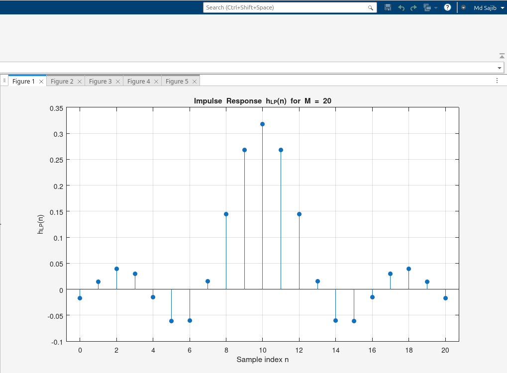
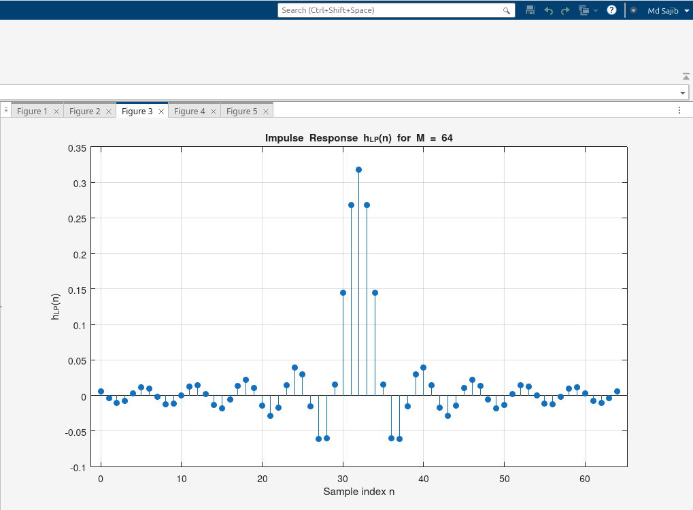
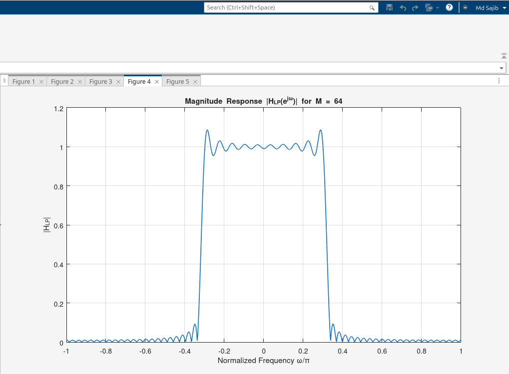
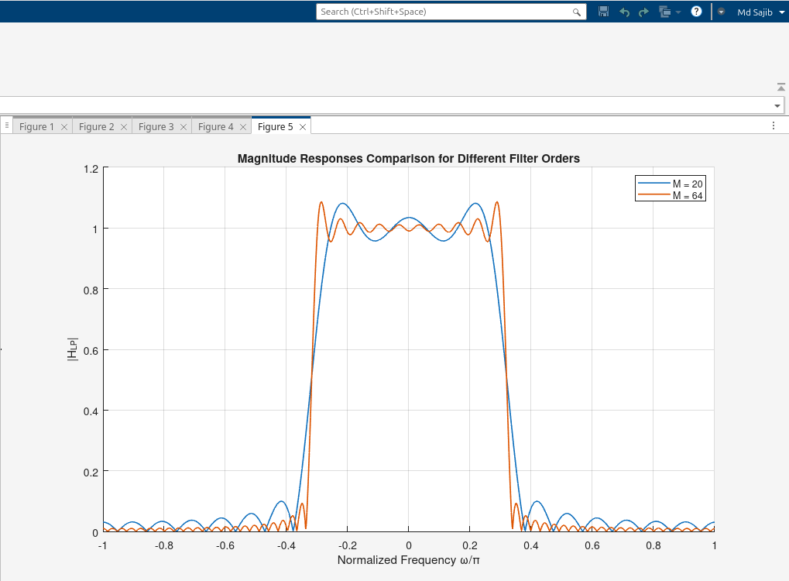

# Exercise 12 – FIR Low-Pass Filter Design Using Sinc Function

**Author:** Md Sajib Pramanic  
**Date:** 29-Oct-2025  
**MATLAB Version:** R2025a

---

## Screenshots of Plots

- **Impulse Response and Magnitude Response for M = 20**  
  


- **Impulse Response and Magnitude Response for M = 64**  
  


- **Comparison of Magnitude Responses (M = 20 vs M = 64)**  


---

## Short Explanation

In this exercise, I designed FIR low-pass filters using the sinc function for two different filter orders, **M = 20** and **M = 64**. As the filter order increases, the **transition band becomes narrower**, allowing sharper separation between passband and stopband. The **impulse response length also increases** with higher M, giving more filter taps to approximate the ideal response. A larger M results in a **smoother and more accurate frequency response**, reducing ripple in the passband and stopband. By comparing the plots, you can see that the filter with M = 64 has a much sharper cutoff and a longer impulse response than the filter with M = 20. This demonstrates how **filter order directly affects frequency selectivity and response accuracy**.

---

## Notes

- All plots were generated using MATLAB’s `stem`, `fft`, and `fftshift` functions.  
- Figures are saved in the `figures/` directory relative to the script location.


## Run the code

Clone the git repository

```bash
git clone https://github.com/SAJIB3489/mathematical-algorithms.git
cd exercise-12
```