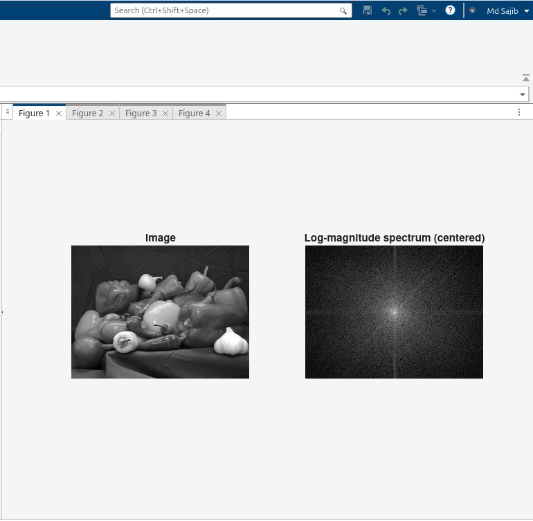
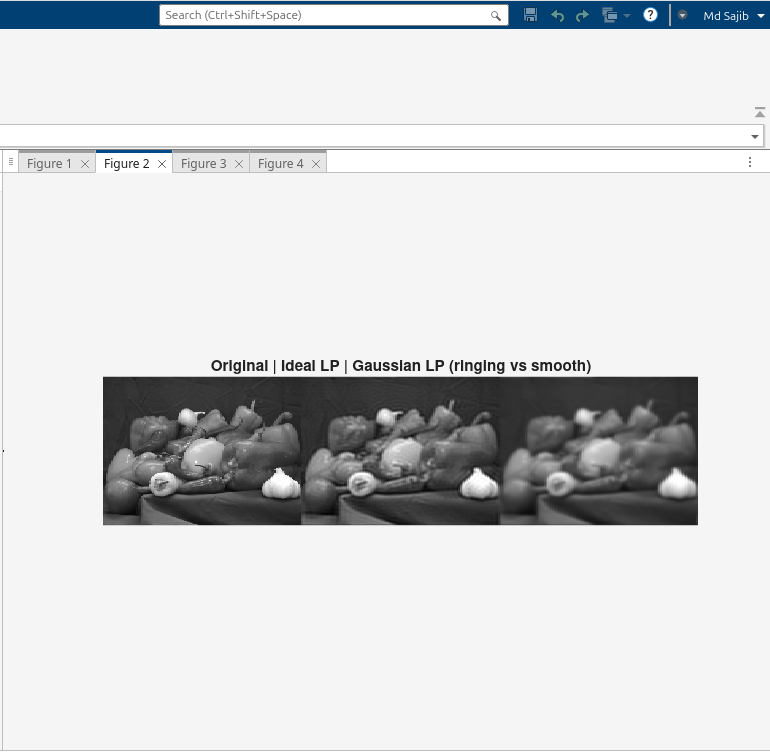
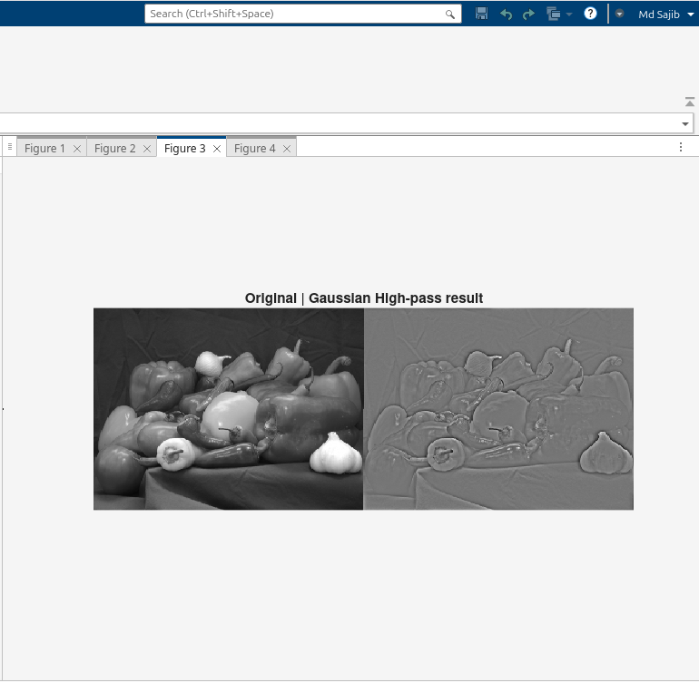
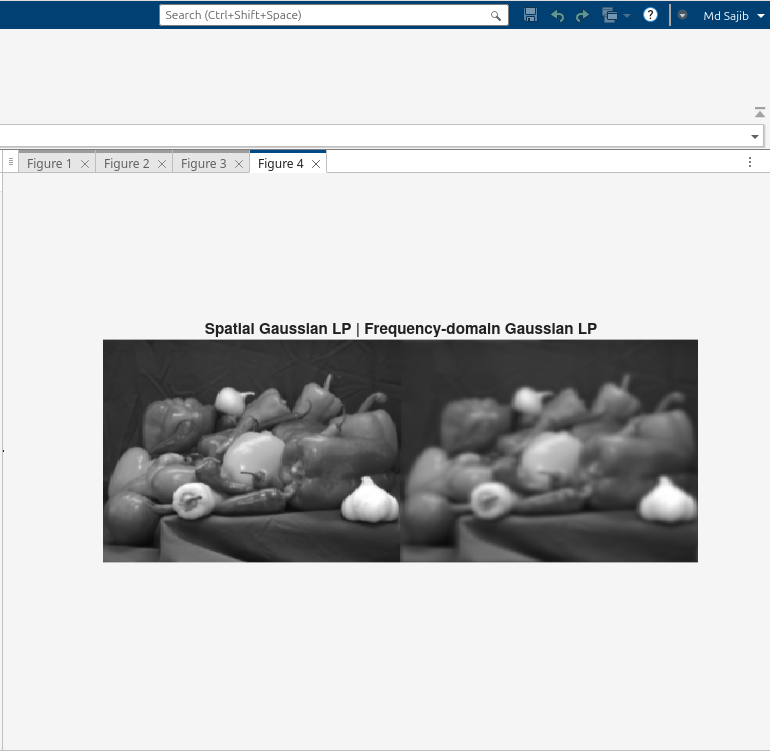

# Lab 3 – Frequency-Domain Filtering with `fft2`

**Author:** Md Sajib Pramanic  
**Date:** 29-Oct-2025  
**Course:** Mathematical Algorithms (DSP) — Image Processing Labs  
**MATLAB Version:** R2025a

---

## Overview

In this lab, I explored **frequency-domain filtering** of grayscale images using the 2D Fast Fourier Transform (`fft2`). The goal was to understand the relationship between **spatial convolution and frequency-domain multiplication**, compare ideal vs Gaussian low-pass filters, and observe the effects of high-pass filtering.

---

## 1) Log-Magnitude Spectrum

The log-magnitude spectrum helps visualize the frequency components of the image.  

**Code snippet:**  
```matlab
F = fft2(I);
Fshift = fftshift(F);
S = log(1 + abs(Fshift));
imshow(S,[]);
```

**Screenshot:**


**Explanation:**
The FFT shifts low frequencies to the center using `fftshift`. Bright spots in the spectrum indicate dominant frequency components.

---

## 2) Low-Pass Filtering in Frequency Domain

I applied both **ideal circular low-pass** and **Gaussian low-pass** filters:

* **Ideal LP**: Hard cutoff (`D <= D0`) caused **ringing artifacts (Gibbs phenomenon)** in the spatial domain.
* **Gaussian LP**: Smooth cutoff (`exp(-D^2/(2*sigma^2))`) produced a smooth, artifact-free image.

**Code snippet:**

```matlab
G_ideal = ifft2(ifftshift(H_ideal_LP .* Fshift));
G_gauss = ifft2(ifftshift(H_gauss_LP .* Fshift));
```

**Screenshot:**


---

## 3) High-Pass Filtering via Complement

By subtracting the Gaussian low-pass from 1, I created a **high-pass filter** to enhance edges:

```matlab
H_gauss_HP = 1 - H_gauss_LP;
G_hp = real(ifft2(ifftshift(H_gauss_HP .* Fshift)));
G_hp = mat2gray(G_hp);
```

**Screenshot:**


**Explanation:**
High-pass filtering highlights rapid intensity changes, emphasizing edges and fine details.

---

## 4) Spatial vs Frequency-Domain Gaussian LP

I compared **spatial-domain Gaussian filtering** with the frequency-domain Gaussian LP to verify the **convolution theorem**:

```matlab
g1d = fspecial('gaussian',[1 7], 1.2);
I_spatial_gauss = imfilter(I, g1d'*g1d, 'replicate');
```

**Screenshot:**


**Explanation:**
The results closely match, confirming that **convolution in the spatial domain equals multiplication in the frequency domain**.

---

## 5) Reflections

1. **Why does the ideal LP cause ringing?**
   Sharp cutoffs introduce discontinuities in the frequency domain, leading to oscillations (Gibbs phenomenon) in the spatial domain.

2. **What does `fftshift` do visually?**
   It moves the zero-frequency component to the center of the image, making the spectrum easier to interpret.

3. **When is frequency-domain filtering preferable?**
   For large images or separable filters, FFT-based filtering is computationally efficient and faster than spatial-domain convolution.

---

## Notes

* All plots are saved in the `figures/` directory relative to the script location.
* The code automatically handles missing images by using `cameraman.tif` as a fallback.
* The lab demonstrates the advantages and limitations of ideal vs Gaussian filters, as well as spatial vs frequency-domain approaches.


## Run the code

Clone the git repository

```bash
git clone https://github.com/SAJIB3489/mathematical-algorithms.git
cd lecture_7_lab_3
```